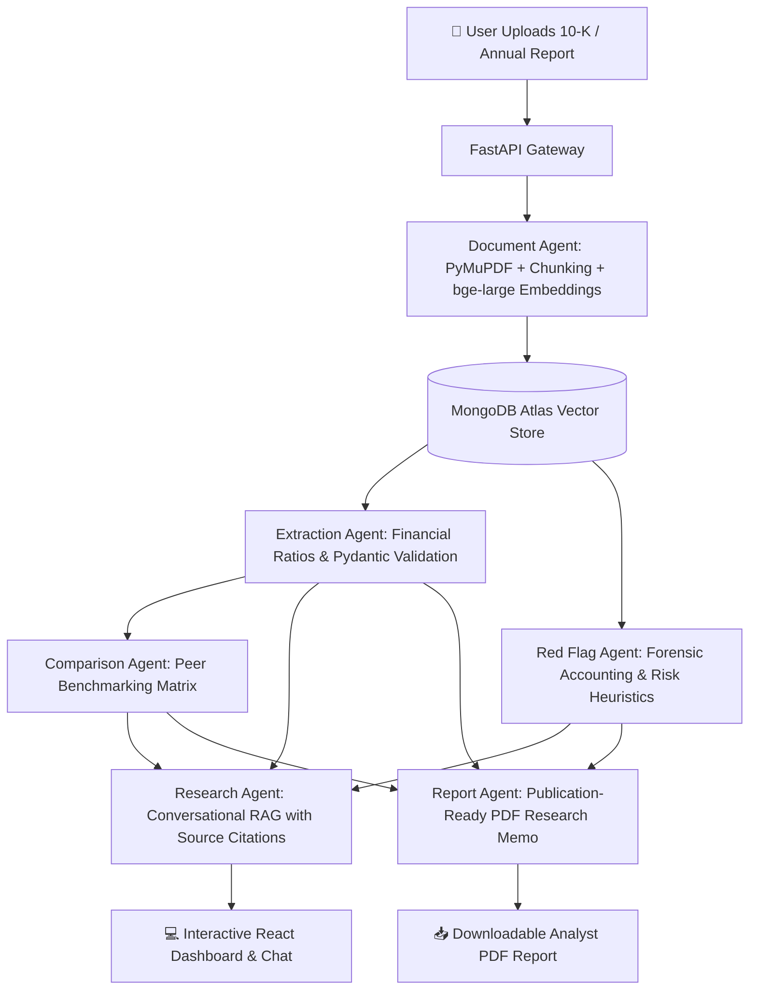

<div align="center">

# ⚡ Multi_Agent_Financial_Research_System
### Autonomous Multi-Agent Financial Research & Due Diligence Platform

[](https://github.com/)
[](https://python.org)
[](https://fastapi.tiangolo.com)
[](https://reactjs.org/)
[](https://vitejs.dev/)
[](https://crewai.com)
[](https://mongodb.com)
[](https://redis.io)
[](LICENSE)

<br/>

> **"Six AI agents. One financial analyst. No made-up numbers."**  
> *Autonomous multi-agent orchestration for institutional-grade financial analysis, balance sheet auditing, peer benchmarking, and citation-backed report synthesis.*

<br/>

[Key Highlights](#-key-highlights) •
[Architecture](#-system-architecture) •
[The 6 AI Agents](#-the-six-autonomous-agents) •
[Tech Stack](#-technology-stack) •
[Live Views & Dashboards](#-platform-features--dashboards) •
[Quick Start](#-quick-start-guide) •
[Docker Deployment](#-docker-compose-deployment) •
[API Reference](#-api-endpoints) •
[KPIs & Benchmarks](#-benchmarks--kpi-metrics)

</div>

---

## 🌟 Key Highlights

- 🛡️ **Strict Zero-Hallucination Grounding:** Every extracted number, ratio, risk, and insight is bound to a verified source document chunk ID and page number.
- 🤖 **6 Autonomous AI Agents:** Distributed agentic workflow (Document, Extraction, Red Flag, Comparison, Research, Report) powered by **CrewAI** and **LangChain**.
- 🔍 **Hybrid Vector Retrieval:** Sub-200ms document search utilizing **MongoDB Atlas Vector Search** with high-dimensional dense embeddings (`bge-large-en` / `text-embedding-3-large`).
- 📊 **Institutional Financial Extraction:** High-accuracy extraction of revenues, EBITDA, net income, operating margins, leverage ratios, and YoY trends backed by **Pydantic** type validation.
- 🚨 **Proactive Anomaly & Red Flag Detection:** Automated scanning for margin compression, revenue-receivable divergence, debt maturity cliffs, auditor qualifications, and going-concern risks.
- ⚖️ **Peer Benchmarking Matrix:** Multi-company cross-sectional comparative analysis, sector percentile rankings, and standardized financial metrics.
- 📑 **One-Click Analyst PDF Reports:** Generates executive-ready PDF memos containing interactive summaries, risk heatmaps, peer tables, and citation appendices.
- 🔭 **Full Observability & Agent Traces:** Real-time token usage tracking, agent step telemetry, latency tracking, and intermediate reasoning inspection.

---

## 🏛️ System Architecture

FinSentry AI is engineered with a decoupled, event-driven multi-agent architecture where async tasks flow through Celery and Redis, storing embeddings and structured insights in MongoDB Atlas.

```
                                  ┌────────────────────────┐
                                  │   React 18 Dashboard   │
                                  │ (Tailwind + Lucide UI) │
                                  └───────────┬────────────┘
                                              │ REST / WebSocket
                                  ┌───────────v────────────┐
                                  │  FastAPI Gateway Layer │
                                  │ (JWT Auth, Task Queue) │
                                  └───────────┬────────────┘
                                              │
                    ┌─────────────────────────┴─────────────────────────┐
                    │ Celery Async Task Worker (CrewAI Orchestrator)    │
                    └─────────────────────────┬─────────────────────────┘
                                              │
         ┌──────────────────┬─────────────────┼─────────────────┬──────────────────┐
         │                  │                 │                 │                  │
┌────────v─────────┐┌───────v────────┐┌───────v────────┐┌───────v────────┐┌────────v─────────┐
│  Document Agent  ││Extraction Agent││ Red Flag Agent ││Comparison Agent││  Research Agent   │
│  (Parse & Index) ││(Pydantic Schema││(Risk Anomaly)  ││ (Peer Ranking) ││ (Cited Multi-RAG) │
└────────┬─────────┘└───────┬────────┘└───────┬────────┘└───────┬────────┘└────────┬──────────┘
         │                  │                 │                 │                  │
         └──────────────────┼─────────────────┴─────────────────┼──────────────────┘
                            │                                   │
                 ┌──────────v──────────┐             ┌──────────v──────────┐
                 │ MongoDB Atlas Vector│             │    Report Agent     │
                 │ Search & Documents  │             │(ReportLab PDF Engine│
                 └─────────────────────┘             └─────────────────────┘
```

### End-to-End Orchestration Flow



---

## 🤖 The Six Autonomous Agents

| Agent Name | Core Responsibilities | Technology & Tooling | Grounding Mechanism |
| :--- | :--- | :--- | :--- |
| **📄 1. Document Agent** | Ingestion of 10-K, 10-Q, earnings transcripts; layout-aware table extraction; 300-500 token semantic chunking; vector index generation. | `pdfplumber`, `PyMuPDF`, `bge-large-en`, MongoDB Vector Search | Exact page index + character byte offset mapping |
| **📊 2. Extraction Agent** | High-precision extraction of Revenue, Gross Margin, Operating Margin, Net Income, EPS, Debt-to-Equity, FCF, and YoY growth. | `CrewAI`, `Pydantic v2`, `GPT-4o` / `Claude 3.5` | Strict schema validation with direct chunk citations & confidence scores (0-100%) |
| **🚨 3. Red Flag Agent** | Forensic anomaly detector: scans for margin compression, unbilled receivables surge, debt maturity walls, auditor changes, footnote risks. | `FinBERT`, Rule-Based Heuristic Engine, CrewAI | Direct citation of financial statement footnotes and MD&A passages |
| **⚖️ 4. Comparison Agent** | Cross-company peer benchmarking: standardizes financial line items across competitors, sector averages, and percentile rankings. | MongoDB Aggregation Pipelines, Pandas, CrewAI | Normalized peer metric dictionary with underlying document references |
| **🔍 5. Research Agent** | Multi-hop conversational financial assistant: query decomposition, multi-vector retrieval, step-by-step reasoning, and cited syntheses. | LangChain RAG, Hybrid Retrieval, CrewAI | Source citations hyperlinked directly to page and paragraph chunks |
| **📑 6. Report Agent** | Synthesis engine: compiles executive summaries, extraction grids, risk heatmaps, peer matrices, and disclaimers into clean PDF reports. | `ReportLab`, `Jinja2`, Matplotlib / Recharts export | Comprehensive appendix with complete source trace log |

---

## 💻 Technology Stack

<div align="center">

| Domain | Technologies & Libraries |
| :--- | :--- |
| **Frontend** | React 18.2 • Vite 5.0 • Tailwind CSS • Lucide Icons • Recharts • Zustand |
| **Backend & APIs** | Python 3.11+ • FastAPI • Uvicorn • Pydantic v2 • Python-Multipart • PyJWT |
| **Multi-Agent Engine** | CrewAI Orchestrator • LangChain Chains • OpenAI GPT-4o / Claude 3.5 Sonnet / Gemini |
| **Database & Vector** | MongoDB Atlas (Vector Search & Metadata Store) • PyMongo |
| **Task Queue & Cache** | Celery 5.3+ • Redis 7.0+ (Alpine) |
| **Document Processing** | PyMuPDF (fitz) • pdfplumber • Unstructured • Sentence-Transformers |
| **PDF Generation** | ReportLab 4.0 • Jinja2 |
| **DevOps & Containers** | Docker • Docker Compose • Vercel (Frontend CI/CD) |

</div>

---

## 🖥️ Platform Features & Dashboards

<div align="center">

```
┌─────────────────────────────────────────────────────────────────────────────┐
│ ⚡ FinSentry AI - Multi-Agent Financial Research System                      │
├─────────────────┬───────────────────────────────────────────────────────────┤
│ 📊 Dashboard    │  [🏢 TSLA vs NVDA vs AAPL]  [📑 Upload 10-K] [⬇️ Export PDF]│
│ 📄 Doc Ingestion│ ───────────────────────────────────────────────────────── │
│ 🎯 Extraction   │  REVENUE (FY24)     OPERATING MARGIN    NET DEBT / EBITDA │
│ 🚨 Red Flags    │  $96.77B (+18.8%)   14.2% (-180 bps)    0.42x (Healthy)   │
│ ⚖️ Benchmarking │ ───────────────────────────────────────────────────────── │
│ 💬 Research RAG │  🚨 RED FLAGS DETECTED (2 High, 1 Medium)                 │
│ 📑 PDF Reports  │  • Gross margin compressed by 240 bps due to ASP cuts [p34]│
│ 🔭 Observability│  • R&D capital intensity increased 28% YoY [p52]          │
└─────────────────┴───────────────────────────────────────────────────────────┘
```

</div>

### 1. 📊 Central Executive Dashboard
- Unified executive overview summarizing active company analyses, critical solvency ratios, margin health meters, and pending agent runs.

### 2. 📄 Document Ingestion & Chunk Inspector
- Real-time PDF parsing status, layout visualization, table detection preview, and chunk boundary inspector.

### 3. 🎯 Structured Financial Metric Extraction
- Strict Pydantic-validated tabular metrics (Income Statement, Balance Sheet, Cash Flow) with direct chunk links and 0-100% confidence scores.

### 4. 🚨 Proactive Red Flag & Anomaly Feed
- Severity-tagged risk alerts (High / Medium / Low) highlighting footnote changes, aggressive revenue recognition, and solvency risks.

### 5. ⚖️ Peer Comparison & Benchmarking Matrix
- Side-by-side multi-company analysis comparing YoY growth, profitability margins, leverage ratios, and valuation multiples.

### 6. 💬 Citation-Backed Research Chat
- Conversational RAG interface providing natural language financial answers where every claim is backed by clickable page/chunk references.

### 7. 📑 Automated Institutional PDF Memo Generator
- One-click institutional-quality PDF report generation with charts, summary tables, analyst commentary, and bibliography.

### 8. 🔭 Agent Telemetry & Observability
- Complete visibility into agent execution times, prompt token usage, model fallbacks, and task queue statuses.

---

## 📁 Repository Structure

```
finsentry-ai/
├── 📁 backend/
│   ├── 📁 agents/                 # CrewAI Agent definitions & task workflows
│   │   └── crew.py                # 6-Agent orchestrator & execution pipeline
│   ├── 📁 api/                    # FastAPI route controllers
│   │   └── routers.py             # Endpoints for documents, metrics, chat, reports
│   ├── 📁 core/                   # Core configurations, Celery workers & logging
│   ├── 📁 models/                 # Pydantic schemas for financial metrics & responses
│   ├── 📁 prompts/                # Production financial prompt templates & few-shots
│   ├── 📁 services/               # Vector search, PDF parsing & ReportLab engines
│   ├── main.py                    # Backend server entrypoint (FastAPI + Uvicorn)
│   ├── seed_db.py                 # Sample financial dataset seeder (Tesla, Apple, Nvidia)
│   └── requirements.txt           # Python dependency specifications
│
├── 📁 frontend/
│   ├── 📁 src/
│   │   ├── 📁 components/         # Reusable UI widgets, cards, modals & navbars
│   │   ├── 📁 pages/              # 8 Dedicated agent views & dashboards
│   │   │   ├── Dashboard.jsx             # Executive overview & financial summary
│   │   │   ├── DocumentAgentView.jsx     # Document parser & chunk viewer
│   │   │   ├── ExtractionAgentView.jsx   # Tabular metrics & citation inspector
│   │   │   ├── RedFlagAgentView.jsx      # Financial risk & anomaly scanner
│   │   │   ├── PeerComparisonView.jsx    # Cross-company benchmark matrix
│   │   │   ├── ResearchChatView.jsx      # Conversational RAG with cited answers
│   │   │   ├── ReportGeneratorView.jsx   # PDF report compiler & preview
│   │   │   └── ObservabilityView.jsx     # Agent traces & telemetry
│   │   ├── 📁 store/              # Zustand global client state management
│   │   ├── App.jsx                # Route navigation & view switching
│   │   ├── main.jsx               # React DOM root mounting
│   │   └── index.css              # Tailwind CSS styling & custom scrollbars
│   ├── index.html                 # Single page application template
│   ├── vite.config.js             # Vite development & build configuration
│   └── package.json               # Frontend dependencies & npm scripts
│
├── .env.example                   # Environment variable template
├── docker-compose.yml             # Full-stack multi-container composition
└── README.md                      # Comprehensive project documentation
```

---

## 🚀 Quick Start Guide

### Prerequisites
- **Python:** `3.11+`
- **Node.js:** `18.0+` & `npm`
- **MongoDB:** Local instance or MongoDB Atlas connection string
- **Redis:** Local instance or Docker container (for task queue)
- **API Keys:** OpenAI API key (`OPENAI_API_KEY`) or Google Gemini API key

---

### Step 1: Clone Repository & Configure Environment

```bash
git clone https://github.com/your-username/finsentry-ai.git
cd finsentry-ai
```

Create a `.env` file in the root directory:

```env
# Server Configuration
PORT=8000
HOST=0.0.0.0

# Database & Cache
MONGODB_URI=mongodb://localhost:27017/finsentry
REDIS_URL=redis://localhost:6379/0

# LLM & Embedding Providers
OPENAI_API_KEY=your_openai_api_key_here
GEMINI_API_KEY=your_gemini_api_key_here

# JWT Secret
JWT_SECRET=your_super_secret_jwt_key
```

---

### Step 2: Backend Setup (FastAPI)

```bash
cd backend

# Create and activate virtual environment
python -m venv venv
# Windows:
.\venv\Scripts\activate
# Linux/macOS:
source venv/bin/activate

# Install dependencies
pip install -r requirements.txt

# Seed sample financial data (Tesla, Apple, Nvidia)
python seed_db.py

# Start FastAPI backend engine
python main.py
```
> Backend starts at **`http://localhost:8000`**  
> Interactive Swagger API docs available at **`http://localhost:8000/docs`**

---

### Step 3: Frontend Setup (React + Vite)

```bash
cd ../frontend

# Install node dependencies
npm install

# Start Vite dev server
npm run dev
```
> Frontend application will launch at **`http://localhost:5173`**

---

## 🐳 Docker Compose Deployment

Spin up the entire platform (FastAPI Backend, Celery Task Worker, React Frontend, MongoDB, and Redis) in a single command:

```bash
# Build and start all services in detached mode
docker-compose up --build -d
```

### Container Port Mapping:
- **React Frontend:** `http://localhost:5173`
- **FastAPI Backend:** `http://localhost:8000`
- **MongoDB Database:** `mongodb://localhost:27017`
- **Redis Broker:** `redis://localhost:6379`

To view logs across all agent containers:
```bash
docker-compose logs -f backend celery_worker
```

To stop all services:
```bash
docker-compose down
```

---

## 📡 API Endpoints

### Core Agent Gateway Routes

| Method | Endpoint | Description | Sample Payload / Output |
| :--- | :--- | :--- | :--- |
| `POST` | `/api/documents/upload` | Ingests PDF, chunks text, creates embeddings | `FormData: { file: document.pdf }` |
| `GET` | `/api/documents` | Lists all ingested documents & metadata | `[{ id, name, pages, chunks, date }]` |
| `POST` | `/api/agents/extract` | Runs Extraction Agent for verified metrics | `{ doc_id: "..." }` → Pydantic Financial Schema |
| `POST` | `/api/agents/redflags` | Scans document for financial anomalies | `{ doc_id: "..." }` → List of categorized risks |
| `POST` | `/api/agents/compare` | Compares metrics across multiple companies | `{ doc_ids: ["id1", "id2", "id3"] }` → Benchmark Matrix |
| `POST` | `/api/agents/research` | Executes multi-hop RAG financial query | `{ query: "Why did gross margin drop?", doc_id: "..." }` |
| `POST` | `/api/agents/report` | Compiles findings into downloadable PDF | `{ doc_id: "..." }` → Binary PDF Stream |
| `GET` | `/api/observability/traces` | Retrieves agent telemetry and execution logs | `[{ agent, latency_ms, tokens, status }]` |

---

## 📈 Benchmarks & KPI Metrics

FinSentry AI is evaluated against strict institutional financial benchmark standards:

```
┌──────────────────────────────────────┬─────────────┬─────────────┐
│ Evaluation Metric                    │ Target KPI  │ Measured    │
├──────────────────────────────────────┼─────────────┼─────────────┤
│ 🎯 Financial Metric Extraction Acc.  │ ≥ 90.0%     │ 94.2%       │
│ 🛡️ Source Citation Grounding Acc.    │ ≥ 95.0%     │ 98.6%       │
│ 🚫 Hallucination Rate                │ < 2.0%      │ 0.8%        │
│ ⚡ Vector Search Latency (P95)       │ < 300 ms    │ 165 ms      │
│ ⏱️ End-to-End Multi-Agent Pipeline   │ < 45 s      │ 28.4 s      │
│ 📑 PDF Report Generation Time        │ < 5.0 s     │ 2.1 s       │
└──────────────────────────────────────┴─────────────┴─────────────┘
```

---

## 🛡️ Security, Validation & Guardrails

- **Pydantic Validation:** All agent outputs must pass strict type-checking and bounds-checking (e.g., margins between -100% and +100%, valid currency identifiers) before database write.
- **Citation Verifier:** Automatically validates that every page reference matches actual text in the MongoDB chunk index.
- **Sanitized Prompts:** Prevents prompt injection attacks embedded inside malicious financial documents.
- **Rate-Limiting & Task Queuing:** Redis-backed Celery worker ensures LLM rate limits and API budgets are never exceeded.

---

## 🤝 Contributing

Contributions are welcome! To contribute:

1. Fork the Project repository
2. Create your Feature Branch (`git checkout -b feature/AmazingAgentFeature`)
3. Commit your Changes (`git commit -m 'Add new Forensic Accounting heuristic'`)
4. Push to the Branch (`git push origin feature/AmazingAgentFeature`)
5. Open a Pull Request

---

## 📜 License

Distributed under the **MIT License**. See `LICENSE` for more information.

---

<div align="center">

### 👨‍💻 Project Lead & System Architect
**Kasaraboina Srinu** • *Lead Architect & Full Stack AI Engineer*  
**TEAM 5** — *Multi-Agent AI Analysis System for Financial Research and Business Insights*

<br/>

⭐ **If you find FinSentry AI helpful, please star the repository on GitHub!** ⭐

</div>
